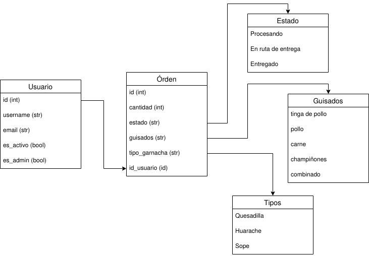

# API de entrega de comida a domicilio (FastAPI)

## **Rutas**

| **MÉTODO** | **RUTA**                            | **DESCRIPCIÓN**                   | **ACCESO**         |
|------------|-------------------------------------|-----------------------------------|--------------------|
| _POST_     | _/auth/registro/_                     | Registrar un nuevo usuario        | Todos los usuarios |
| _POST_     | _/auth/entrar/_                       | Acceso de un usuario              | Todos los usuarios |
| _POST_     | _/ordenes/_                        | Ordenar algo                      | Todos los usuarios |
| _PUT_      | _/ordenes/{id_orden}/_ | Actualizar una orden              | Todos los usuarios |
| _PATCH_      | _/ordenes/{id_orden}/_     | Actualizar el estado de una orden | Administrador (a)  |
| _DELETE_   | _/ordenes/{id_orden}/_     | Borrar una orden                  | Todos los usuarios |
| _GET_      | _/ordenes/usuario/_             | Mostrar todas las órdenes hechas  | Todos los usuarios |
| _GET_      | _/ordenes/_                     | Mostrar todas las órdenes         | Administrador (a)  |
| _GET_      | _/ordenes/usuario/{id_usuario}/_                     | Mostrar todas las órdenes de un usuario        | Administrador (a)  |
| _GET_      | _/ordenes/{id_orden}/_          | Mostrar una orden                 | Administrador (a)  |
| _GET_      | _/ordenes/usuario/{id_orden}/_  | Mostar una orden de un usuario    | Todos los usuarios |
| _GET_      | _/auth/usuarios/_                            | Muestra a todos los usuarios registrados    | Administrador (a) |
| _GET_      | _/docs/_                            | Ver la documentación de la API    | Todos los usuarios |

## Organización de los modelos en la base de datos



## Funcionamiento

Primero tienes que crear una base de datos PostgreSQL para poder interactuar con la app, simplemente ingresa los datos de tu base de datos en el siguiente pedazo de código que está en ```database/db.py```:

```python3
engine = create_engine(
    'postgresql://<usuario>:<contraseña>@localhost:5432/<nombre_base_datos>',
    echo=True
    )
```

Posteriormente corre el archivo ```launch.sh```:

```bash
chmod +x launch.sh
./launch.sh
```

El archivo creará un ambiente virtual nuevo con ```virtualenv``` y ```python3.9```(**asegurate de tenerlos instalados**), instalará todos los paquetes necesarios que se encuentran en ```requirements.txt```, activará la base de datos y correrá la aplicación con ```uvicorn```, para probar la aplicación dirígete a _localhost:8000/docs_ (usualmente la aplicación se corre en el puerto 8000, si no es así, revisa en dónde la está corriendo en la consola).

Y listo, ahora podrás interactuar con la API a través de la documentación interactiva de Swagger UI y OpenAPI.